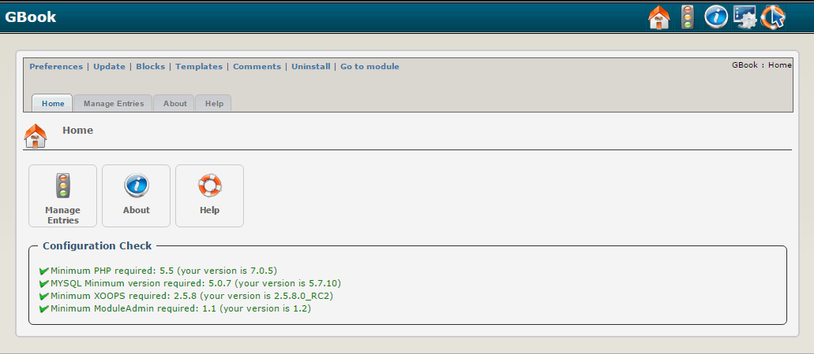

### _XOOPS Documentation Series_

# Module References
#### for XOOPS 2.5.8
      

            
## User Manual

© 2016 XOOPS Project ([www.xoops.org](http://xoops.org))  

## Module Purpose 

**Références** est un module Xoops qui vous permettra de créer un nombre illimité de références clients. 

Il est réalisé en langage Php et utilise la base de données Open Sources Mysql. 
Ce programme a été développé pour s’insérer dans un environnement Xoops .  
 
L’avantage essentiel de ce produit par rapport aux solutions existantes sur le marché, c’est sa facilité de mise en œuvre puisque ce module est opérationnel en moins de 15 minutes (installation et paramétrage) 

##Fonctionnalités 
 
- Catégorisation des références 

Chaque référence est rattachée à une catégorie afin d’organiser l’information. 
 
- Flux RSS des dernières références 
- Affichage moderne avec effet d’accordéon et « lightview » 
- Choix de l’éditeur de texte à utiliser pour créer ses références 
- Création automatique des vignettes de chaque copie d’écran 
- Possibilité d'utiliser un système de mots clés (TAGS) 
- Possibilité d'activer une notification lors de la création d'une nouvelle référence 
- Intégration à la recherche Xoops 
- Possibilité de cloner le module 
- Gestion de cache afin d’améliorer les performances sur un environnement fortement sollicité 
- Gestion des permissions sur les catégories 

 

*Figure 1: Main view of the References Module (Admin side)*

## Download/Fork the Module  

**You can fork the module --> [here](https://github.com/XoopsModules25x/XXX))** 

## How to Contribute

[You can contribute on GitHub](https://github.com/XoopsDocs/references-tutorial). Changes will be [pushed to Gitbook.io automatically](https://www.gitbook.com/book/xoops/references-tutorial/activity) when the [main repository](https://github.com/XoopsDocs/references-tutorial) changes.

Editing the book can be done either by updating the markdown files with a text editor, or opening the repository in [the Gitbook desktop app](https://github.com/GitbookIO/editor/blob/master/README.md). The desktop app will give you a live preview option.

# Table of Content

* [Install/Uninstall](book/1install.md)
* [Administration](book/2administration.md)
* [Préférences du module](book/3preferences.md)
* [Operating Instructions](book/4operations.md)
* [Côté utilisateur](book/5userside.md)
* [Blocs](book/6blocks.md)
* [Templates](book/7templates.md)
* [Contenu du répertoire Extra](book/8other.md) 
* [Module Credits](book/9credits.md)
* [About XOOPS CMS](book/10aboutxoops.md)

##License:

 Unless specified, this content is licensed under a <a rel="license" href="http://creativecommons.org/licenses/by-nc-sa/4.0/">Creative Commons Attribution-NonCommercial-ShareAlike 4.0 International License</a>.

All derivative works are to be attributed to XOOPS Project ([www.xoops.org](http://xoops.org))

